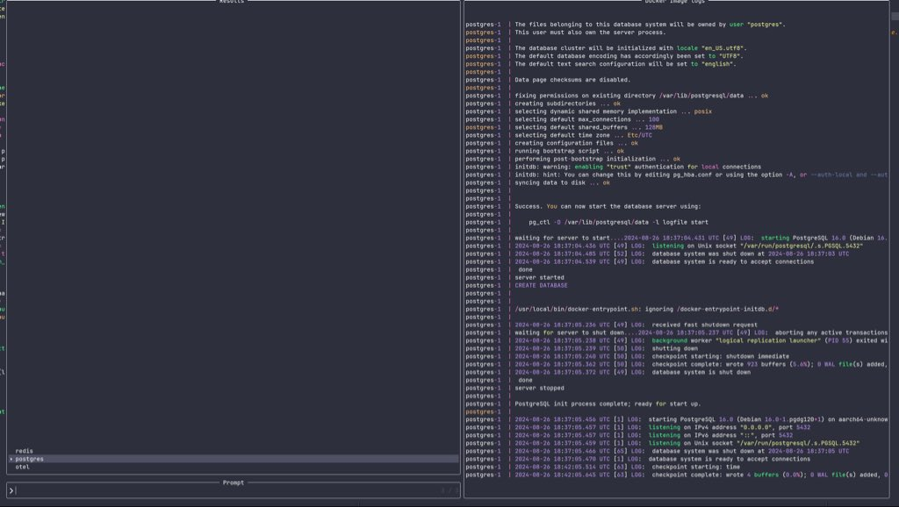

# dockercomposelogs.nvim

A Telescope extension for viewing logs from your docker compose containers
running in the current working directory.



## ✨ Features

- Lists the containers currently running by their service names
- View logs from the container
- Configurable by default, show color, hide timestamps and more

> This supports only docker compose containers as they are really the most useful.
> If i have nvim opened in a directory and working on a project, i am interested
> in the containers running for that project. Let me know if you think otherwise

## ⚡️ Requirements

- Neovim ( a recent version )
- Properly installed docker environment on your machine.
  - `docker` command must be available

## 📦 Installation

Install the plugin with your preferred package manager:

### [lazy.nvim](https://github.com/folke/lazy.nvim)

```lua
  {
    "adelowo/dockercomposelogs.nvim",
    config = function()
      require("dockercomposelogs").setup({})
    end,
    event = "VeryLazy",
    dependencies = {
      "nvim-telescope/telescope.nvim",
    },
  },
```

This gives you access to the `DockerComposeLogs` command

## ⚙️ Configuration

### Setup

```lua

opts = {
 no_log_prefix = true, -- show the service name in the logs
 show_timestamps = false, -- show the timestamps in the logs
 use_color = true, -- colorize the output in the previewer pane
 -- how far in the logs do you want to go? This is in minutes.
 -- Must be a valid number. 2 to 60 accepted
 logs_since = 10,
}

```
